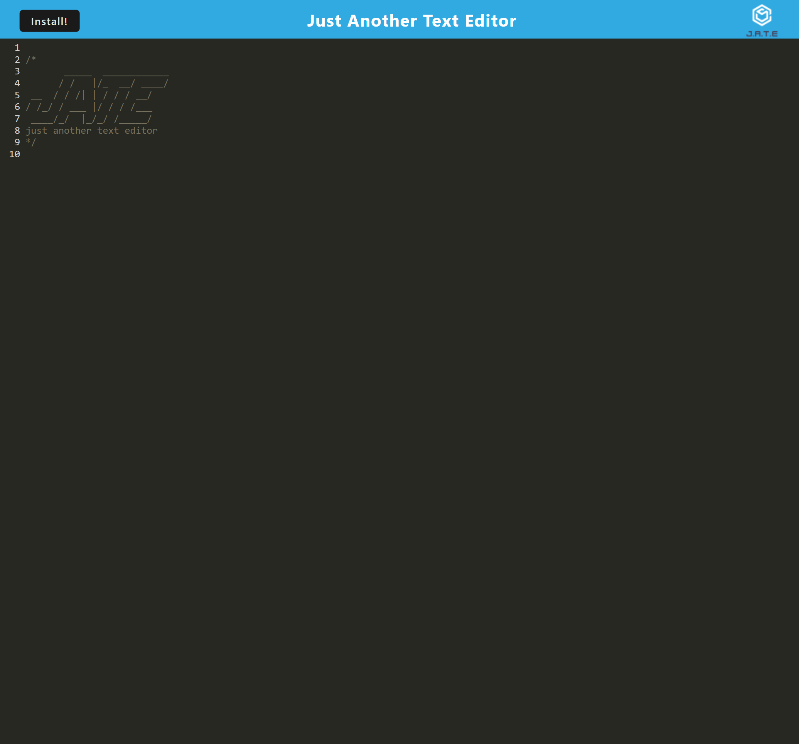

# PWA Text Editor

## Table of Contents

- [Description](#description)
- [Installation](#installation)
- [Licenses](#licenses)
- [Contributing](#contributing)
- [Questions](#questions)

## Description

This application is a web text editor that follows Progressive Web Application (PWA) standards. The user can create notes or code snippets with or without an internet connection and where the user can reliably retrieve them for later use. The integrated service worker and Cache API's ensure that the application will remain fully functional even without and active internet connection. This application allows the user to access visited pages even if the application is offline.

Link to deployed application: https://pwatexteditorjate-11397ea91dfe.herokuapp.com/

## Installation

To use the application there is no installation needed. Just simply navigate to the application URL above in a web browser. From there the application can be installed locally if desired by clicking the "Install" button on the top left.

In terms of installing the application repository files, instructions would be to clone the files from the github repository to your local machine, install the necessary npm packages and then run 'npm start' from the terminal, then browse to http://localhost:3000/ in a web browser.

## Licenses

    This project is covered under the MIT license. To learn more about what this means, click the license badge at the top.

## Contributing

You are welcome to contribute to this project by forking the project or contacting me via my Github profile or email address found below in the Questions section.

## Questions

Feel free to contact me via the following links with any questions about this application.

GitHub: https://github.com/gmgabrie  
Email: ggabriel420@gmail.com
